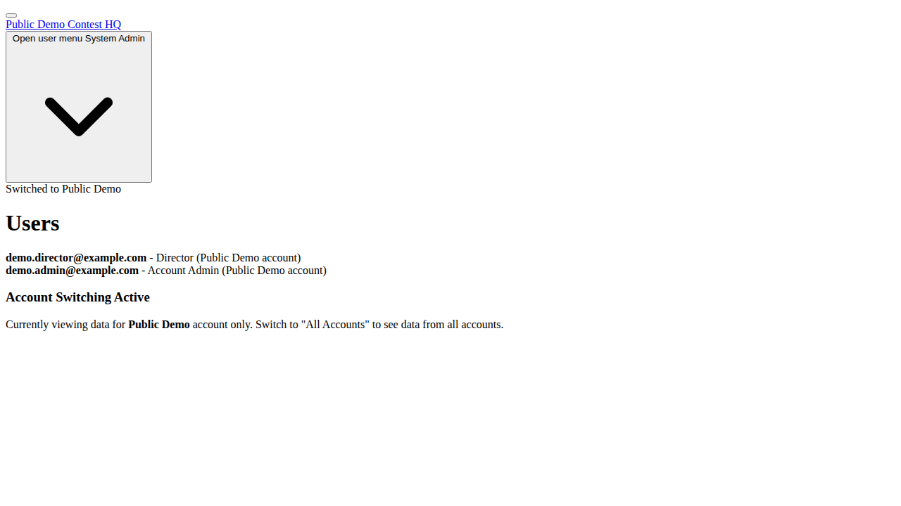
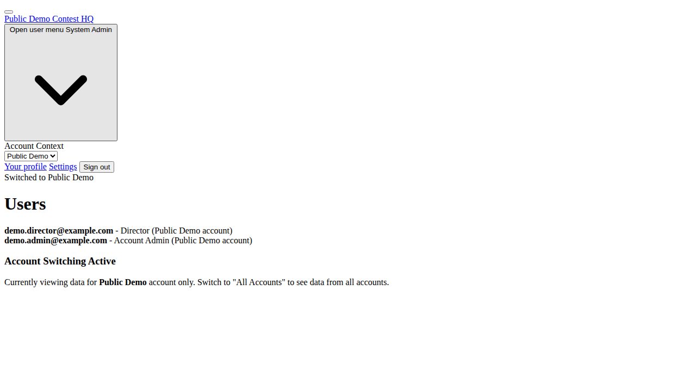
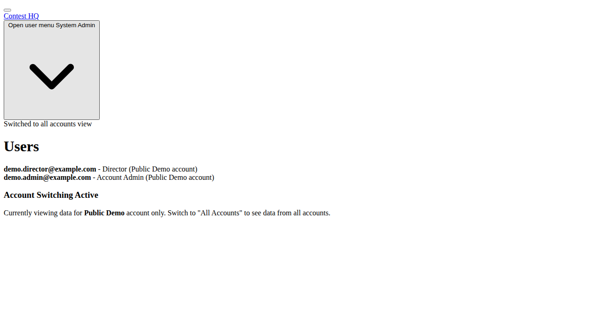

# Account Switching Feature

## Overview

The Account Switching feature allows system administrators to temporarily scope their view to a single account at a time, while maintaining the ability to switch between accounts as needed. This reduces cognitive overload and decreases the risk of accidentally modifying data in the wrong account context.

## How It Works

### For System Administrators

1. **Account Switcher Dropdown**: Located in the user profile dropdown menu, sysadmins can see an "Account Context" section with a dropdown to select which account to view.

2. **Account Selection**: Sysadmins can choose from:
   - "All Accounts" (default) - Shows data from all accounts
   - Any specific account - Shows only data from that account

3. **Visual Feedback**: 
   - The application title updates to show the selected account context
   - Flash messages confirm account switches
   - Selected account persists across page requests

### For Regular Users

- Account switcher is not visible to non-sysadmin users
- Account scoping works exactly as before
- No changes to user experience

## Technical Implementation

### Core Components

1. **Current Model Enhancement**
   - Added `selected_account` attribute
   - Added `effective_account` method to return the appropriate account context

2. **AccountScoped Concern Update**
   - Modified to respect selected account for sysadmins
   - Falls back to showing all accounts when no account is selected
   - Preserves existing behavior for regular users

3. **Account Switching Controller**
   - Handles POST requests to switch accounts
   - Stores selected account ID in session
   - Provides feedback messages

4. **UI Components**
   - Account switcher dropdown in user profile menu
   - Updated navbar to show selected account name
   - Styled with Tailwind CSS to match existing design

### Session Management

The selected account is stored in the session under `selected_account_id` and is restored on each request for sysadmin users.

## Usage Examples

### Switching to a Specific Account

1. Click on your profile dropdown in the top navigation
2. In the "Account Context" section, select the desired account
3. The page will refresh showing only data from that account
4. The application title will update to reflect the selected account

### Returning to All Accounts View

1. Click on your profile dropdown
2. Select "All Accounts" from the dropdown
3. The view will return to showing data from all accounts

## Screenshots

### Initial State (All Accounts)

### Dropdown Open with Account Switcher

### After Switching to All Accounts

## Testing

The feature includes comprehensive test coverage:

- **System Tests**: Test the complete user workflow through the UI
- **Controller Tests**: Test the account switching endpoints
- **Model Tests**: Test the Current model and AccountScoped concern behavior
- **Integration Tests**: Ensure account scoping works correctly across requests

## Security Considerations

- Only system administrators can access the account switching functionality
- Non-sysadmin users are redirected if they attempt to access switching endpoints
- Account scoping is enforced at the model level for security
- Session-based storage prevents account selection from persisting beyond the session

## Benefits

1. **Reduced Cognitive Load**: Sysadmins can focus on one account at a time
2. **Error Prevention**: Reduces risk of accidentally modifying wrong account data
3. **Improved UX**: Clear visual feedback on current account context
4. **Maintained Flexibility**: Easy switching between accounts and return to global view
5. **Non-disruptive**: Zero impact on existing user workflows